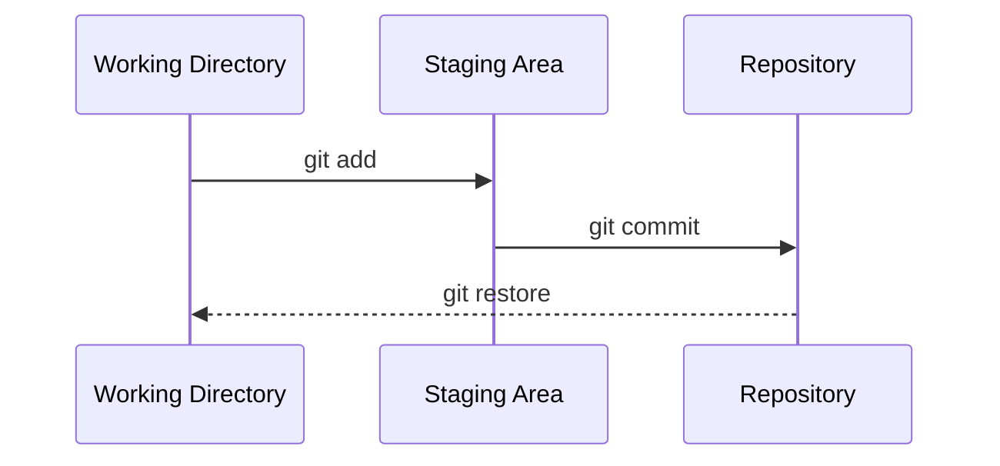

# Comandos Essenciais do Git

Este arquivo documenta os comandos Git fundamentais que todo desenvolvedor deve conhecer

## 📋 Objetivos de Aprendizagem

Ao final deste capítulo, você será capaz de:
- Inicializar novos repositórios e clonar projetos existentes.
- Utilizar o ciclo básico de salvamento no Git (add, commit, status).
- Visualizar o histórico e as diferenças entre as alterações realizadas.
- Desfazer pequenas mudanças e compreender os estados dos arquivos no Git.

## 🎯 Introdução

A linha de comando (ou terminal) é a interface principal e mais poderosa para interagir com o Git. Embora existam diversas interfaces gráficas, aprender os comandos fundamentais ajuda a entender como o Git realmente funciona por baixo dos panos, facilitando a resolução de problemas e dando mais flexibilidade e velocidade ao seu fluxo de trabalho de desenvolvimento.

## Estrutura dos Comandos Git

A estrutura geral da maioria dos comandos Git segue o seguinte padrão:
`git <comando> <opções> <argumentos>`

Por exemplo, no comando `git commit -m "mensagem"`, `commit` é o comando, `-m` é uma opção (flag) e `"mensagem"` é o argumento dessa opção.

A sintaxe do Git segue um padrão lógico:
git <comando> <opções> <argumentos>
- git: O executável principal.
- comando: A ação (ex: commit, add).
- opções: Modificadores que começam com - ou -- (ex: -m, --global).
- argumentos: O alvo da ação (ex: nome do arquivo ou link do repositório).

###  Obtendo Ajuda

Se você esquecer o que um comando faz ou quais opções ele aceita, o próprio Git possui manuais integrados muito detalhados:

```bash
# Mostra uma ajuda rápida sobre um comando específico no terminal
git <comando> -h
git add -h

# Abre o manual completo (geralmente no navegador ou paginador) sobre o comando
git help <comando>
git help commit
```

## git init

O comando `git init` é usado para criar um novo repositório Git em branco ou para reinicializar um existente. Ele transforma um diretório normal (pasta do seu computador) em um repositório Git, permitindo que você comece a rastrear as alterações nele.

### Sintaxe

```bash
git init
```

### Quando Usar

Você deve usar o `git init` quando estiver começando um projeto do zero na sua máquina local e quiser colocá-lo sob controle de versão.

### Exemplo Prático

```bash
# 1. Cria uma nova pasta para o projeto
mkdir meu-novo-projeto

# 2. Entra na pasta
cd meu-novo-projeto

# 3. Inicializa o repositório Git
git init

# 4. Verifica o resultado
ls -a # Você verá uma pasta oculta chamada .git
```

### O que Acontece

Ao rodar `git init`, o Git cria uma pasta oculta chamada `.git` dentro do seu diretório atual. Essa pasta contém todos os metadados, banco de dados de objetos e configurações necessárias para o controle de versão. Seu diretório agora é o "Working Directory".

## git clone

O comando `git clone` é usado para copiar um repositório existente, geralmente de um servidor remoto (como o GitHub), para o seu computador local.

### Sintaxe

```bash
git clone <url-do-repositorio>

# Opcional: especificar um nome de pasta diferente
git clone <url-do-repositorio> <nome-da-pasta>
```
#### Variantes Comuns:

Clonar em um diretório específico:
```bash
git clone <url> <nome-do-diretorio>
```

Clonar apenas uma branch específica:
```bash
git clone -b <branch> <url>
```

Clonar com profundidade limitada (histórico reduzido):
```bash
git clone --depth 1 <url>
```

Clonar usando SSH:
```bash
git clone git@github.com:usuario/repositorio.git
```

Clonar usando HTTPS:
```bash
git clone https://github.com/usuario/repositorio.git
```

### Diferença entre init e clone
`git init`:
- Cria um novo repositório Git vazio localmente;
- Não possui histórico nem conexão com repositórios remotos;
- Usado para iniciar um projeto do zero.

`git clone`:
- Copia um repositório existente, incluindo todo o histórico e branches;
- Configura automaticamente a origem remota (`origin`);
- Usa-se quando se deseja trabalhar com um projeto já existente, seja para contribuir ou para ter uma cópia local.

| Critério              | `git init`        | `git clone`           |
|----------------------|-----------------|-----------------------|
| Ponto de partida     | Projeto novo    | Projeto existente     |
| Histórico            | Vazio           | Completo              |
| Remote origin        | Não configurado | Configurado automaticamente |

### Exemplo Prático

```bash
# Clonar um repositório do GitHub
git clone https://github.com/usuario/projeto-exemplo.git

# Entrar na pasta do projeto clonado
cd projeto-exemplo
```
Isso irá:
1. Criar uma pasta chamada `git` no diretório atual;
2. Baixar todo o repositório do Git, incluindo seu histórico completo;
3. Configurar a origem remota para `origin`.

Depois disso, basta entrar no diretório (`cd git`) e começar a trabalhar com o repositório clonado.

### Clonando seu Fork

Um fork é uma cópia de um repositório feita dentro da sua conta (por exemplo, no GitHub).

Passos:

1. Faça um fork do repositório original (clicando em "Fork" na interface do GitHub);
2. Copie a URL do seu fork;
3. Use `git clone` com a URL do seu fork para obter uma cópia local.

```bash
git clone https://github.com/seu-usuario/repositorio.git
```

Opcionalmente, você pode adicionar o repositório original como upstream para manter seu fork atualizado:

```bash
cd repositorio
git remote add upstream https://github.com/usuario-original/repositorio.git
```

E, por fim, para atualizar seu fork com as mudanças do repositório original:

```bash
git fetch upstream
git switch main
git merge upstream/main
```

## git add

O comando `git add` é usado para selecionar quais arquivos modificados você quer preparar para o seu próximo commit. Ele move as alterações do seu diretório de trabalho para a **Staging Area** (Área de Preparação).

### Sintaxe

```bash
# Adiciona um arquivo específico
git add index.html

# Adiciona vários arquivos
git add arquivo1.txt arquivo2.txt

# Adiciona todos os arquivos modificados e novos na pasta atual
git add .

# Adiciona todos os arquivos do projeto (modificados, novos e deletados)
git add -A
```

### Staging Area

A **Staging Area** é como se fosse uma "caixa" ou "sala de espera" onde você coloca os arquivos que farão parte do seu próximo commit.
Ela existe para que você tenha um controle preciso do que será salvo. Em vez de salvar todas as modificações do seu projeto de uma vez, você pode agrupar alterações relacionadas (criando *commits seletivos*).

### Exemplos

Imagine que você modificou 3 arquivos, mas 2 deles são sobre o formulário de contato e 1 é um ajuste no rodapé. Você pode "commitar" de forma organizada:

```bash
# 1. Verifique as mudanças
git status

# 2. Adicione apenas os dois arquivos do formulário:
git add formulario.html
git add css/form.css

# 3. Se precisar ver o que já está na Staging Area (pronto para o commit):
git diff --staged

# 4. Caso tenha adicionado um arquivo por engano, você pode desfazer o add:
git restore --staged css/form.css
```

### Boas Práticas

Evite usar `git add .` às cegas. Sempre verifique quais arquivos foram modificados usando `git status` antes. Prefira adicionar arquivos individualmente ou por partes lógicas para garantir que seus commits tenham um único propósito bem definido.

## git status

O comando `git status` exibe o estado do diretório de trabalho e da área de preparação. É o comando mais importante e você deve usá-lo o tempo todo!

### O que Mostra

Ele mostra:
- Arquivos que não estão sendo rastreados (Untracked files).
- Arquivos modificados que ainda não foram preparados (Changes not staged for commit).
- Arquivos preparados e prontos para o commit (Changes to be committed).
- Qual branch você está no momento.

### Exemplo de Saída

```bash
$ git status
On branch main
Changes to be committed:
  (use "git restore --staged <file>..." to unstage)
        modified:   index.html

Changes not staged for commit:
  (use "git add <file>..." to update what will be committed)
  (use "git restore <file>..." to discard changes in working directory)
        modified:   style.css

Untracked files:
  (use "git add <file>..." to include in what will be committed)
        script.js
```
*Na saída acima: `index.html` está na staging area; `style.css` foi modificado, mas não está preparado; `script.js` é um arquivo novo que o Git não conhece.*

### Quando Usar

Use **antes e depois** de comandos como `git add` e `git commit` para garantir que você não está fazendo nada errado. Se estiver na dúvida sobre o que fazer, rode `git status`.

## git commit

O comando `git commit` cria um registro permanente das mudanças que foram
adicionadas à área de staging com `git add`. Cada commit funciona como um ponto
salvo na história do projeto, contendo um identificador único, autor, data,
mensagem descritiva e o conjunto de alterações incluídas.

Use commits para dividir o trabalho em etapas pequenas e compreensíveis. Assim,
fica mais fácil revisar mudanças, desfazer problemas e entender a evolução do
código ao longo do tempo.
## git commit

O comando `git commit` salva as alterações da *staging area* no histórico do repositório, criando um novo ponto na linha do tempo do projeto.

### Sintaxe

```bash
# TODO: Formas de fazer commit
git commit -m "feat: add resnet50 architecture" # git commit -m "mensagem"
git commit                                      # git commit (abre editor)
git commit -am                                  # -am "mensagem. fix: corrige erro no carregamento do dataset
git commit -m                                   # feat: adiciona camada de dropout ao modelo"
```

- `-m`: define a mensagem do commit  
- `-a`: adiciona automaticamente arquivos já rastreados

---

### Componentes de um commit

Cada commit contém:

- SHA-1 hash (identificador único)
- Autor e email
- Timestamp
- Mensagem
- Alterações realizadas

---

### Boas práticas de mensagem

<!-- TODO: O que é um bom commit? -->
Um commit deve ser atômico: deve resolver apenas uma coisa (um bug, uma feature, uma documentação). Se você mudou 10 arquivos com 3 propósitos diferentes, faça 3 commits separados.

Exemplos:

Boa:
```text
Add login button
Fix authentication bug
```

Ruim:
```text
Fix stuff
Update things
```

---

### Opções úteis

```bash
git commit --amend
```

Permite alterar o último commit.

---

### Commit vazio

```bash
git commit --allow-empty -m "Mensagem"
```

Usado para marcar eventos ou disparar pipelines.

---

### Verificação

```bash
git log
```

Exibe o histórico de commits.

---

### Atomicidade

Um commit deve representar uma única mudança lógica.

---

### Conceitos

- Mensagem de commit  
- Atomicidade  
- Rastreabilidade  
- Histórico limpo


## git log

O comando `git log` é usado para visualizar o histórico de commits do seu repositório. Ele mostra informações detalhadas sobre cada commit realizado, incluindo autor, data, mensagem e identificador único (hash).

## Sintaxe Básica

**Formato padrão (detalhado):**

```bash
git log
```

Este comando exibe:
- **Hash do commit**: Identificador único (ex: `a1b2c3d4e5f6...`)
- **Autor**: Nome e e-mail de quem fez o commit
- **Data**: Quando o commit foi realizado
- **Mensagem**: Descrição do que foi feito

**Formato resumido (uma linha por commit):**

```bash
git log --oneline
```

Mostra apenas o hash abreviado e a mensagem do commit, ideal para ter uma visão geral rápida do histórico.

## Entendendo o Output

Quando você executa `git log`, verá algo assim:

```
commit a1b2c3d4e5f6g7h8i9j0 (HEAD -> main, origin/main)
Author: João Silva <joao@email.com>
Date:   Mon May 1 14:30:00 2023 -0300

    docs: adiciona seção sobre git init

commit k9l8m7n6o5p4q3r2s1t0
Author: Maria Santos <maria@email.com>
Date:   Mon May 1 10:15:00 2023 -0300

    fix: corrige exemplo de git clone
```

**Elementos importantes:**
- **(HEAD -> main, origin/main)**: Indica onde está o ponteiro HEAD e os branches
- **Hash do commit**: Identificador único de 40 caracteres (exibido completo)
- **Author**: Nome e e-mail configurados no Git
- **Date**: Data e hora do commit com timezone
- **Mensagem**: Descrição do que foi alterado

## Opções Úteis

**Visualização gráfica de branches:**
```bash
git log --graph
```
Mostra um gráfico ASCII com a estrutura de branches e merges.

**Ver todos os branches:**
```bash
git log --all
```
Exibe commits de todos os branches, não apenas o atual.

**Mostrar referências (tags e branches):**
```bash
# Mostra cada commit em apenas uma linha (Hash e Mensagem)
git log --oneline

# Mostra o histórico em forma de árvore/grafo (útil quando há múltiplas branches)
git log --graph --oneline

# Filtra commits de um autor específico
git log --author="Antonio"

# Filtra commits recentes
git log --since="2 weeks ago"
```
Indica onde estão as branches e tags no histórico.

**Combinando opções (recomendado):**
```bash
git log --oneline --graph --all
```
Formato compacto com visualização gráfica de todos os branches.

## Filtros de Busca

**Por autor:**
```bash
git log --author="João Silva"
```

**Por mensagem de commit:**
```bash
git log --grep="docs"
```
Busca commits que contenham "docs" na mensagem.

**Por período:**
```bash
git log --since="2 weeks ago"
git log --until="2023-05-01"
```

**Combinando filtros:**
```bash
git log --author="Maria" --since="1 month ago" --oneline
```

## Exemplo Prático

Para ver um histórico visual completo do projeto:

```bash
git log --oneline --graph --all --decorate
```

Resultado esperado:

```
* a1b2c3d (HEAD -> main, origin/main) docs: adiciona seção sobre git init
* k9l8m7n (feat/nova-funcionalidade) feat: implementa nova feature
| * b2c3d4e (fix/correcao-bug) fix: corrige erro de digitação
|/
* m7n6o5p docs: atualiza README
* q3r2s1t Initial commit
```

**Interpretando o gráfico:**
- `*` = Commit
- `|` = Linha do branch
- `/` = Merge ou divergência de branches
- Os hashes são abreviados (7 caracteres)
- As referências (HEAD, branches) aparecem entre parênteses

## git log vs git reflog

**git log:**
- Mostra o histórico de **commits** do projeto
- Lista apenas commits que fazem parte do histórico oficial
- Útil para ver o que foi desenvolvido

**git reflog:**
- Mostra **todas as ações** realizadas no repositório local
- Inclui mudanças de branch, resets, rebases, merges
- Útil para recuperar trabalho perdido

Exemplo de quando usar cada um:
- "Quais commits foram feitos no projeto?" → `git log`
- "Fiz um reset errado, como voltar?" → `git reflog`

## Navegando no Pager

Quando o histórico é longo, o Git usa um pager (less) para exibir o conteúdo:

- **Descer**: Seta para baixo ou Enter
- **Subir**: Seta para cima
- **Próxima página**: Espaço
- **Buscar**: Digite `/` seguido do termo
- **Sair**: Pressione `q`

**Dica**: Se você não quiser usar o pager, adicione `--no-pager`:
```bash
git --no-pager log --oneline
```

## git diff

<!-- TODO: Explique git diff -->
Mostra a diferença textual entre estados dos arquivos.

### Tipos de Diff

```bash
# Mostra as diferenças entre o Working Directory e a Staging Area
# (O que você mudou, mas ainda não fez "git add")
git diff

# Mostra as diferenças entre a Staging Area e o último commit
# (O que vai entrar no próximo commit)
git diff --staged

# Mostra a diferença entre as alterações totais não comitadas e o último commit
git diff HEAD

# Compara dois commits diferentes usando seus Hashes
git diff <hash_antigo> <hash_novo>
```

### Lendo a Saída

Na saída do diff:
- Linhas que começam com `+` (geralmente verdes) indicam código adicionado.
- Linhas que começam com `-` (geralmente vermelhas) indicam código removido.

## git restore

O `git restore` é um comando moderno introduzido em versões mais recentes do Git para desfazer alterações e remover arquivos da staging area de forma mais intuitiva que o antigo `git reset` e partes do `git checkout`.

### Desfazendo Mudanças

O `git restore` possui duas áreas de atuação principais, dependendo de onde as modificações estão no seu repositório:

#### 1. Desfazer mudanças no diretório de trabalho
Se você modificou um arquivo, mas **não o adicionou** com `git add`, pode descartar as mudanças no diretório de trabalho e restaurá-lo para o conteúdo que está no **index** (que normalmente coincide com o último commit, quando não há mudanças staged):

```bash
# Descarta todas as modificações não "staged" do arquivo
git restore <arquivo>

# Exemplo prático:
git restore index.html
```

> ⚠️ **Cuidado:** Esta operação é destrutiva. As alterações locais ainda não adicionadas ao staging serão perdidas permanentemente e não poderão ser recuperadas.

#### 2. Remover da área de preparação (Unstage)
Se você adicionou um arquivo com `git add` por engano e deseja removê-lo da *staging area* (sem perder as modificações no arquivo físico):

```bash
# Remove o arquivo do staging area (unstage)
git restore --staged <arquivo>

# Exemplo prático:
git restore --staged config.js
```

#### 3. Restaurar de um commit específico
Você também pode buscar a versão de um arquivo de um commit passado ou branch específica, em vez do último commit (HEAD):

```bash
# Desfaz as alterações de um arquivo no Working Directory (volta para o estado do último commit)
# CUIDADO: Isso APAGA suas alterações não salvas definitivamente!
git restore index.html

# Remove o arquivo da Staging Area (Unstage), mas MANTÉM as alterações no arquivo
git restore --staged index.html
```

### Exemplo Prático: Recuperação de Arquivo Deletado

Um dos usos mais valiosos do `git restore` é recuperar arquivos deletados acidentalmente. Se você excluiu um arquivo importante no seu sistema (mas não comitou a exclusão), você pode trazê-lo de volta facilmente:

```bash
# O arquivo foi deletado acidentalmente no sistema de arquivos
$ rm arquivo_importante.txt

# Verificando o status
$ git status
# deleted:    arquivo_importante.txt

# Recuperando o arquivo do último commit
$ git restore arquivo_importante.txt
```

### Diferenças e Alternativas

É importante entender como o `git restore` se compara a outros comandos de desfazer no Git:

#### `git restore` vs `git revert`
- O **`git restore`** restaura o conteúdo de arquivos no diretório de trabalho e/ou na área de stage, **sem alterar o histórico de commits**.
- O **`git revert`** atua sobre commits já registrados no histórico, **criando um novo commit de reversão** para desfazer as alterações de um commit anterior.

#### `git restore` vs `git checkout`
Antes do Git 2.23, o comando `git checkout` era usado tanto para trocar de branches quanto para restaurar arquivos. Essa dupla função causava confusão. A alternativa antiga para `git restore <arquivo>` era `git checkout -- <arquivo>`. Embora o `checkout` ainda funcione para este propósito por questões de compatibilidade, o uso do **`restore` é a prática recomendada moderna** por ser mais claro, seguro e ter uma intenção única e explícita.

## git rm

<!-- TODO: Explique git rm -->
git rm: Remove o arquivo do disco e já prepara a deleção no Git.

### Removendo Arquivos

```bash
# Remove o arquivo e prepara a remoção
git rm arquivo-obsoleto.txt
git commit -m "chore: remove arquivo obsoleto"
```

### Diferença de rm normal

Se você usar o comando de terminal normal `rm arquivo.txt`, o arquivo some, mas o Git o registra como uma "Change not staged". Você teria que rodar `git add arquivo.txt` para preparar a remoção. O `git rm` faz os dois passos de uma vez.

## git mv

Usado para mover ou renomear arquivos.

### Renomeando/Movendo Arquivos

```bash
# Renomear um arquivo
git mv nome-antigo.txt nome-novo.txt

# Mover um arquivo para uma pasta
git mv arquivo.txt pasta/arquivo.txt
```
O Git reconhece automaticamente como uma alteração do tipo renomeação, deixando preparado (staged) para o commit.

## Fluxo de Trabalho Básico

O fluxo de trabalho clássico (e infinito) do desenvolvedor no Git é:



### Exemplo Completo

```bash
git clone https://github.com/meu-usuario/projeto.git
cd projeto
# [Eu edito alguns arquivos de código]
git status
git add app.js index.html
git commit -m "feat: adiciona lógica inicial do app"
git log --oneline
```

## Comandos de Consulta

### git show

Mostra o conteúdo detalhado, mensagens e as alterações de um commit específico.

```bash
# Ver os detalhes do último commit (HEAD)
git show HEAD

# Ver detalhes de um commit através de seu Hash
git show a1b2c3d
```

### git blame

Mostra quem modificou cada linha de um arquivo por último, exibindo o autor e o hash do commit. Ótimo para descobrir quem causou aquele bug ou tirar dúvidas com o autor do trecho de código.

```bash
git blame arquivo.txt
```

## Exemplos Práticos

### Exemplo 1: Criando Primeiro Repositório

```bash
mkdir novo-site
cd novo-site
git init
echo "# Meu Novo Site" > README.md
git status
git add README.md
git commit -m "docs: cria o README inicial"
git log --oneline
```

### Exemplo 2: Clonando e Contribuindo

```bash
git clone https://github.com/exemplo/repositorio.git
cd repositorio
# Editar um arquivo
git status
git diff
git add .
git commit -m "fix: corrige erro de digitação"
```

### Exemplo 3: Desfazendo Alterações

```bash
# Se eu fiz uma alteração indesejada num arquivo
git status
git restore index.html # Minha alteração errada some, volto ao código limpo do último commit
```

## Erros Comuns

### Erro 1: Esquecer de git add

Fazer um `git commit` achando que as alterações serão salvas, mas o Git diz que não há nada para commitar. 
**Solução:** Sempre rode `git status` e `git add` antes.

### Erro 2: Mensagem de commit vaga

Escrever `git commit -m "ok"` ou `git commit -m "mudanças"`. Em seis meses, você não fará ideia do que isso significa. 
**Solução:** Descreva **o que** mudou de forma resumida e direta.

### Erro 3: Committar arquivos errados

Fazer um `git add .` às cegas e acidentalmente adicionar senhas, chaves de API ou arquivos pesados/pessoais que não deveriam ir para o repositório.
**Solução:** Sempre use `git status` antes de adicionar, e aprenda sobre `.gitignore`.

### Erro 4: Confundir git reset e git restore

- `git restore`: Trabalha nos arquivos. Usado para desfazer modificações em arquivos soltos.
- `git reset`: Trabalha na linha do tempo. Usado para voltar ou desfazer commits inteiros (veja no capítulo de resolução de problemas).

## Exercícios

1. Crie uma nova pasta no seu computador chamada `treino-git` e transforme-a em um repositório Git usando `git init`.
2. Crie um arquivo `anotacoes.txt`, adicione um texto qualquer, e faça seu primeiro `commit`.
3. Altere o texto desse arquivo. Rode `git diff` para visualizar a alteração no terminal, depois adicione (`add`) e comite (`commit`).
4. Visualize seu histórico com `git log --oneline`.
5. Modifique o arquivo de novo, mas não adicione (sem `add`). Use o comando `git restore` para descartar a sua mudança e confirme rodando `git status`.

## Tabela de Referência Rápida

| Comando | O que faz | Quando usar |
|---------|-----------|-------------|
| `git init` | Inicializa um novo repositório em branco | No início de um projeto novo localmente |
| `git clone` | Baixa uma cópia de um repositório da web | Para trabalhar em um projeto já existente |
| `git add` | Move mudanças para a Staging Area | Antes de committar, para separar suas alterações |
| `git commit` | Salva um snapshot (foto) na linha do tempo | Para salvar um grupo de mudanças lógicas concluídas |
| `git status` | Exibe o estado atual dos arquivos | Constantemente, para saber o que está acontecendo |
| `git log` | Exibe o histórico de commits | Para ver o que foi feito no passado e por quem |
| `git diff` | Exibe as linhas exatas que foram alteradas | Para revisar suas mudanças detalhadamente antes do add/commit |
| `git restore` | Desfaz alterações ou tira da staging area | Para descartar código indesejado que não foi comitado |

## Recursos Adicionais

- [Git Reference Manual - Comandos Principais](https://git-scm.com/docs)
- [Git Cheat Sheet Interativo](https://ndpsoftware.com/git-cheatsheet.html)
- [Aprenda Git Branching (Visual e Prático)](https://learngitbranching.js.org/)

## Resumo

- O ciclo de vida do salvamento de arquivos no Git é essencialmente: `Modificar -> git add -> git commit`.
- **`git status`** é o seu melhor amigo. Use sem moderação.
- O histórico é valioso e permanente (`git log`).
- O **`git diff`** mostra *exatamente* o que mudou, enquanto o status mostra *onde* mudou.
- Você pode sempre recuar de erros nos arquivos modificados usando **`git restore`**.

---

```bash
git commit -m "Criei o Guia Completo sobre Comandos Essenciais do Git"
```

## 👥 Contribuidores

<!-- Este conteúdo é colaborativo. Contribuidores deste arquivo: -->
<!-- Adicione seu nome quando contribuir: -->
- [@idarlandias](https://github.com/idarlandias) - Seção Comando git add
<!-- Adicione seu nome quando contribuir:
- [@Tom-Junior](https://github.com/Tom-Junior) - Seção todas
-->
- [@Giseleptbr](https://github.com/Giseleptbr) - Seção git commit
- [@hailtonDavid](https://github.com/hailtonDavid) - Seção git restore
