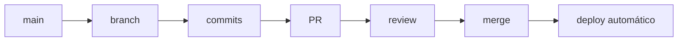

# Workflows no GitHub

<!-- Este arquivo explica diferentes workflows e recursos do GitHub -->

## 📋 Objetivos de Aprendizagem

- Entender o que são workflows de desenvolvimento e por que são necessários
- Dominar o Fork Workflow para contribuições em projetos Open Source
- Conhecer os principais modelos de branching (GitHub Flow, Git Flow, Trunk-Based)
- Utilizar recursos avançados do GitHub (Issues, Projects, Actions, Pages)
- Aplicar boas práticas de segurança e colaboração na plataforma

## 🎯 Introdução

O GitHub evoluiu de um simples serviço de hospedagem de código para uma plataforma completa de colaboração e automação de engenharia de software. Hoje, ele oferece ferramentas integradas para gerenciamento de projetos, integração contínua (CI/CD), segurança de código e publicação de documentação.

## O que é um Workflow?

Um **workflow** (fluxo de trabalho) de desenvolvimento é um conjunto padronizado de práticas, regras e processos que uma equipe adota para colaborar no mesmo código-fonte. Ele define como as branches são criadas, como o código é revisado e como as versões chegam à produção, garantindo organização e minimizando conflitos.

## Fork Workflow

### O que é Fork?

Um **Fork** é uma cópia completa de um repositório de outra pessoa para a sua própria conta no GitHub. Diferentemente de um simples clone local, o fork cria um repositório remoto sob o seu controle, permitindo que você faça alterações livremente sem afetar o projeto original.

### Quando Usar

O Fork Workflow é o padrão absoluto para:
- Contribuir para projetos **Open Source** (onde você não tem permissão de escrita).
- Fazer grandes experimentações baseadas em um projeto existente.
- Criar a sua própria versão de um software livre.

### Passo a Passo

#### 1. Fork do Repositório

Acesse a página do repositório original no GitHub e clique no botão **"Fork"** no canto superior direito. Isso criará uma cópia do repositório na sua conta (`seu-usuario/nome-do-repo`).

#### 2. Clone do Fork

Baixe a SUA cópia (o fork) para a sua máquina local:

```bash
git clone https://github.com/seu-usuario/nome-do-repo.git
cd nome-do-repo
```

#### 3. Configurar Upstream

Para manter seu fork atualizado com as mudanças que acontecem no projeto original, adicione o repositório original como um controle remoto chamado `upstream`:

```bash
git remote add upstream https://github.com/dono-original/nome-do-repo.git
```

#### 4. Criar Branch

Nunca trabalhe diretamente na branch `main`. Crie uma branch específica para a sua contribuição:

```bash
git switch -c feature/minha-contribuicao
```

#### 5. Fazer Mudanças e Commit

Faça suas alterações no código, adicione os arquivos e crie commits com mensagens claras:

```bash
git add .
git commit -m "feat: adiciona nova funcionalidade XYZ"
```

#### 6. Push para Fork

Envie a branch com as suas alterações para o SEU fork no GitHub:

```bash
git push origin feature/minha-contribuicao
```

#### 7. Abrir Pull Request

Vá até a página do repositório original no GitHub. Você verá um aviso sobre a sua nova branch com um botão **"Compare & pull request"**. Clique nele, preencha a descrição explicando o que você fez e submeta o PR para avaliação dos mantenedores.

#### 8. Manter Fork Atualizado

Antes de começar uma nova contribuição (ou se o seu PR estiver demorando), mantenha a sua branch `main` sincronizada com o projeto original:

```bash
# Baixa as novidades do repositório original
git fetch upstream

# Garante que você está na sua main
git switch main

# Atualiza a sua main local apenas se for possível avançar em fast-forward
git merge --ff-only upstream/main

# Atualiza o seu fork no GitHub
git push origin main
```

### Vantagens

- **Segurança:** Mantenedores do projeto original não precisam dar permissão de escrita para estranhos.
- **Experimentação Livre:** Você pode "quebrar" o seu fork à vontade sem medo de estragar o projeto principal.
- **Escalabilidade:** Permite que milhares de pessoas contribuam para um mesmo projeto de forma organizada.

## GitHub Flow

### O que é

Workflow de desenvolvimento simples e ágil chamado GitHub Flow, onde todas as mudanças partem da branch main e retornam para ela via Pull Request.

### Princípios

1. Main está sempre pronta para deploy (deployable)
2. Uso de branches curtas e descritivas
3. Pull Requests são usados para discussão e revisão de código
4. Mudanças só entram na main após review e aprovação

### Fluxo Completo



### Quando Usar

Projetos que utilizam deploy contínuo (Continuous Deployment) e precisam de agilidade no desenvolvimento, especialmente em equipes pequenas ou médias.

### GitHub Flow vs Git Flow

- GitHub Flow é mais simples e direto
- Não possui branches de release ou develop
- Ideal para deploy contínuo
- Git Flow é mais estruturado e indicado para projetos com versões planejadas

## Git Flow

### O que é

É um workflow clássico, rigoroso e altamente estruturado, criado por Vincent Driessen. Ele define papéis estritos para diferentes branches e foca no lançamento de "versões" pontuais do software.

### Branches Principais

#### main (ou master)

Contém apenas o código que está rodando em produção atualmente. Cada commit na `main` deve ser acompanhado de uma tag de versão (ex: `v1.2.0`).

#### develop

É a branch onde a equipe de desenvolvimento integra as funcionalidades para o próximo lançamento. É a "main" do dia a dia dos desenvolvedores.

### Branches de Suporte

#### feature/*

Criadas a partir da `develop`. Servem para desenvolver novas funcionalidades. Quando prontas, voltam para a `develop`.

#### release/*

Criadas a partir da `develop` quando há funcionalidades suficientes para um novo lançamento. Aqui só se faz correção de bugs finais e ajustes de versão. Quando pronta, vai para a `main` (produção) e volta para a `develop`.

#### hotfix/*

Criadas a partir da `main`. Servem para corrigir um erro crítico que está acontecendo em produção agora. Após a correção, a hotfix vai para a `main` e também volta para a `develop` para que o erro não volte na próxima versão.

### Fluxo Visual

Imagine duas linhas centrais grossas (`main` e `develop`) que correm paralelamente, com `features` saindo e voltando da `develop`, `releases` fazendo a ponte entre `develop` e `main`, e `hotfixes` agindo como curativos de emergência na `main`.

### Quando Usar

Projetos que possuem ciclos de lançamento longos e planejados, como aplicativos de celular (iOS/Android), jogos, software instalado no computador (desktop apps) ou sistemas de bancos, onde não se pode simplesmente "atualizar o site" a qualquer minuto.

## Trunk-Based Development

### O que é

Um workflow onde todos os desenvolvedores fazem commits diretos (ou PRs minúsculos que duram poucas horas) em uma única branch principal (o "tronco" ou *trunk* - geralmente a `main`). 

### Características

- Quase não existem branches de vida longa.
- Exige forte uso de **Feature Flags** (botões de liga/desliga no código) para esconder código que ainda não está pronto dos usuários em produção.
- Depende de uma suíte de testes automatizados impecável.

### Quando Usar

Equipes sêniores altamente maduras e disciplinadas que possuem processos de CI/CD (Integração e Entrega Contínuas) extremamente confiáveis. (Google, Facebook e Netflix operam de forma similar a isso).

## Issues

### O que São Issues

As Issues no GitHub são usadas para organizar tarefas, reportar problemas e discutir melhorias em um projeto.

Elas funcionam como um sistema de gerenciamento de tarefas, permitindo acompanhar o progresso do trabalho e facilitar a colaboração entre os membros da equipe.

### Tipos de Issues

As issues podem representar diferentes tipos de atividades:

- **Bug**: algo não está funcionando corretamente
- **Feature**: sugestão de nova funcionalidade
- **Question**: dúvidas sobre o projeto
- **Documentation**: melhorias ou criação de documentação
- **Discussion**: ideias e debates

### Criando Issues

Para criar uma issue:

1. Acesse a aba "Issues" do repositório
2. Clique em "New Issue"
3. Adicione um título claro e objetivo
4. Descreva o problema ou sugestão com detalhes
5. Adicione labels, assignees e milestones (se necessário)
6. Clique em "Submit new issue"

Uma boa issue deve ser clara, objetiva e conter contexto suficiente para que outra pessoa consiga entender e trabalhar nela.

### Templates de Issues

Os templates de issues são modelos pré-definidos que ajudam a padronizar a criação de novas issues.

Eles ficam localizados na pasta:

.github/ISSUE_TEMPLATE/

Com templates, é possível garantir que todas as informações importantes sejam preenchidas, como descrição, passos para reproduzir um bug e comportamento esperado.

### Labels (Etiquetas)

Labels são etiquetas usadas para categorizar issues e facilitar a organização.

Exemplos de labels comuns:

- bug → problemas no sistema
- enhancement → melhorias
- documentation → mudanças na documentação
- good first issue → ideal para iniciantes
- help wanted → precisa de ajuda

Labels ajudam a priorizar e identificar rapidamente o tipo de tarefa.

#### Labels Comuns

- `bug`: Algo não está funcionando conforme o esperado. (Geralmente vermelha).
- `enhancement`: Uma melhoria ou nova funcionalidade.
- `documentation`: Questões relacionadas ao README ou Wiki.
- `good first issue`: Ideal para recém-chegados ao projeto que querem contribuir e não sabem por onde começar.
- `help wanted`: Os mantenedores precisam de ajuda da comunidade com isso.

### Milestones (Marcos)

Milestones são usados para agrupar issues relacionadas a um objetivo específico, como uma versão ou sprint.

Exemplo:
- Versão 1.0
- Sprint 2

Eles ajudam a acompanhar o progresso de entregas maiores dentro do projeto.

### Assignees

Assignees definem quem é responsável por trabalhar em uma issue.

Ao atribuir uma issue a alguém, fica claro quem está responsável pela tarefa, evitando duplicidade de trabalho.

### Linking Issues e PRs


É possível vincular issues a Pull Requests utilizando palavras-chave no commit ou na descrição do PR.

Exemplos:

```bash
Fixes #54
Closes #10
Relates #20
```

Quando um Pull Request com "Fixes" ou "Closes" é mergeado, a issue correspondente é fechada automaticamente.

## Projects (GitHub Projects)

### GitHub Projects

É uma ferramenta de gestão de projetos poderosa embutida no GitHub, funcionando como um Kanban (estilo Trello/Jira), mas profundamente conectada ao seu código.

O **GitHub Projects** é a ferramenta nativa de gerenciamento de trabalho do GitHub, projetada para funcionar como um **quadro Kanban totalmente integrado** ao seu repositório, *issues* e *pull requests*. Ele elimina a necessidade de ferramentas externas, mantendo **código, documentação e planejamento em um único ecossistema**.

> Esta seção orienta como a equipe pode organizar tarefas, acompanhar o andamento do desenvolvimento e manter *issues*, *pull requests* e planejamento centralizados no GitHub.

#### Principais recursos:

- **Quadro Kanban nativo:** Visualize e organize tarefas em colunas personalizáveis.
- **Integração direta com Issues e PRs:** Cards podem ser criados automaticamente ao vincular issues ou abrir PRs.
- **Campos personalizados (Custom Fields):** Adicione metadados como ``Priority``, ``Size``, ``Type``, ``Assignee`` e ``Iteration`` para filtrar e agrupar dados.
- **Relatórios e Gráficos (Charts):** Painéis automáticos de produtividade, distribuição por prioridade, burn-down e velocity.
- **Planejamento de Sprints:** Utilize o campo ``Iteration`` para agrupar tarefas em ciclos com datas de início e fim, acompanhando o progresso em tempo real.

### Criando um Project

Vá na aba "Projects" da sua organização ou perfil, clique em "New project". 

Para configurar um novo projeto no GitHub:

1. Acesse a aba **Projects** no seu repositório ou no perfil da organização.
2. Clique em **New project**.
3. Selecione o template **Kanban** (recomendado para fluxos ágeis) ou **Table**.
4. Defina um nome descritivo (ex: Projeto de IA) e clique em **Create project**.
5. Vincule repositórios: Vá em ⋮ (menu superior) > **Settings** > **Repositories** e adicione os repositórios que alimentarão o quadro.
6. Ative campos personalizados: Clique em **+ Add field** e crie:

    - ``Priority`` (Single select: Alta, Média, Baixa)
    - ``Size`` (Single select: P, M, G, XL)
    - ``Iteration`` (Iterações automáticas para sprints)

```sh
# Exemplo de como vincular um projeto via CLI
gh project create --owner "seu-org" --title "Projeto de IA"
```

### Colunas

<!-- TODO: To Do, In Progress, Review, Done -->

Um fluxo Kanban básico para equipes de desenvolvimento pode conter quatro colunas principais. Para configurá-las:

1. No seu projeto, clique em **+ Add field** e edite o campo ``Status`` conforme a estrutura abaixo:
    - ``To Do``: Backlog priorizado e pronto para ser iniciado.
    - ``In Progress``: Tarefas em desenvolvimento ativo ou branch criada.
    - ``Review``: PRs abertos aguardando code review ou aprovação de QA.
    - ``Done``: Tarefas com PR *merged*, testadas e entregues.
2. Clique em ⋮ na coluna > **Configure** para definir limites de WIP (Work In Progress) e regras de agrupamento.
3. Use a opção **Group by** > ``Status`` para que o GitHub distribua automaticamente os cards nas colunas corretas.

> **Dica:** Mantenha a coluna ``To Do`` sempre priorizada. Itens não classificados com ``Priority`` ou ``Size`` devem ser triados antes de entrar em ``In Progress``.

### Automatização

Você pode configurar o GitHub Projects para mover os cartões sozinhos. Por exemplo, quando você abre um PR vinculado a uma issue, o cartão da issue move para "In Review". Quando faz o merge, move para "Done".

O GitHub Projects permite criar regras de automação nativas (sem necessidade de GitHub Actions externos) que reagem a eventos do repositório:

1. Acesse ⋮ > **Workflows** > **Add workflow**.
2. Configure a regra para **PR** → **Review automaticamente**:
    - *Trigger*: ``When a pull request is opened or reopened``
    - *Action*: ``Move item to column: Review``
3. Para mover issues automaticamente:
``When an issue is assigned or labeled as "ready" → Move to: In Progress``
``When an issue is closed → Move to: Done``

**Vinculação automática entre Issues e PRs**:
O GitHub detecta palavras-chave no corpo do PR ou commits para criar links bidirecionais e disparar automações:

```
# No corpo do Pull Request ou mensagem de commit:
Fixes #42          # Fecha a issue #42 e marca como Done
Closes #15, #16    # Fecha múltiplas issues
Resolves BUG-123   # Funciona com chaves customizadas de rastreamento
Related to #88     # Apenas vincula, sem fechar
```

Para fechar issues de **outros repositórios**, use a sintaxe completa: `Fixes owner/repo#42`.

Quando o PR é merged, as issues vinculadas são fechadas automaticamente e, se configurado, movidas para a coluna ``Done``.

### Views
<!-- TODO: Board, Table, Roadmap -->

O GitHub Projects oferece múltiplas visões para adaptar o quadro às diferentes necessidades da equipe:

- **Board:** Visão Kanban tradicional. Ideal para o acompanhamento diário, drag-and-drop de cards e validação do fluxo ``To Do → In Progress → Review → Done``.
- **Table:** Planilha interativa. Permite edição em massa, ordenação por ``Priority``, ``Size`` ou ``Assignee``, e filtros avançados (ex: ``Priority:"Alta" Size:"G"``).
- **Roadmap:** visão em linha do tempo baseada em campos de data, útil para acompanhar entregas, marcos e prazos. Arraste barras para ajustar prazos sem alterar o status.
- **Insights e Charts:** Acesse a aba **Charts** para gerar gráficos automáticos:
    - Pizza: Distribuição de tarefas por ``Priority`` ou ``Type``
    - Barras: Conclusão por ``Iteration`` (Sprint)
- **Planejamento de Sprints:**
    1. Ative o campo ``Iteration`` nas configurações do projeto.
    2. Crie iterações com datas (ex: ``Sprint 12: 05/11 – 19/11``).
    3. Use **Board** > **Group by** > ``Iteration`` para visualizar o que entra em cada ciclo.
    4. Acompanhe a saúde do sprint no **Charts** com métricas de *completion rate* e *scope changes*.

> *Boa prática*: Realize o planning semanal usando a view **Table** para arrastar itens do backlog para a ``Iteration`` ativa, e faça o review na view **Board + Charts** para validar o fluxo e ajustar prioridades.

### Boas práticas para a equipe

- Mantenha as tarefas sempre vinculadas a uma issue.
- Atualize o status dos cards conforme o andamento da atividade.
- Use `Priority` e `Size` antes de iniciar uma tarefa.
- Abra pull requests vinculados às issues correspondentes.
- Mova tarefas para `Review` apenas quando estiverem prontas para revisão.
- Revise os gráficos ao final de cada sprint para identificar atrasos e melhorias no fluxo.

## GitHub Actions

### O que São Actions

GitHub Actions é um recurso do GitHub usado para automatizar tarefas dentro de um repositório. Com ele, é possível executar testes, validar código, gerar documentação, publicar aplicações e criar fluxos de CI/CD diretamente a partir de eventos do próprio GitHub.

Na prática, uma Action ajuda a responder perguntas como:

- O código continua funcionando depois de um novo commit?
- Um Pull Request pode ser revisado com segurança?
- Os testes passam antes de permitir o merge?
- Uma aplicação pode ser publicada automaticamente?

Um workflow do GitHub Actions é definido por um arquivo YAML dentro da pasta `.github/workflows/`.

### Casos de Uso

GitHub Actions pode ser usado em diferentes situações, por exemplo:

- Rodar testes automaticamente quando alguém faz `push`
- Validar Pull Requests antes do merge
- Executar tarefas agendadas com `schedule`
- Publicar documentação ou sites estáticos
- Fazer deploy de uma aplicação
- Verificar formatação, lint ou qualidade do código

Esse tipo de automação ajuda equipes a manterem qualidade, consistência e segurança no desenvolvimento.

### Arquivo de Workflow

Um workflow é criado dentro do diretório:

```text
.github/workflows/
```

O arquivo normalmente usa a extensão `.yml` ou `.yaml`.

Exemplo:

```text
.github/workflows/ci.yml
```

Um exemplo básico de estrutura seria:

Os workflows ficam dentro da pasta `.github/workflows/` e são escritos em YAML:

```yaml
# .github/workflows/exemplo.yml
name: Meu Workflow

on:
  push:
    branches: [main]
  pull_request:
    branches: [main]

jobs:
  teste:
    runs-on: ubuntu-latest

    steps:
      - name: Baixar o código do repositório
        uses: actions/checkout@v4

      - name: Executar comando de teste
        run: echo "Testes executados com sucesso"
```

Nesse exemplo:

- `name` define o nome do workflow
- `on` indica quais eventos iniciam a automação
- `jobs` agrupa as tarefas executadas
- `runs-on` define o ambiente de execução
- `steps` lista os passos executados dentro do job
- `uses` chama uma Action pronta
- `run` executa um comando no terminal

### Eventos

Eventos são situações que disparam um workflow. Os mais comuns são `push`, `pull_request` e `schedule`.

#### push

Executa o workflow quando alguém envia commits para uma branch.

```yaml
on:
  push:
    branches: [main]
```

#### pull_request

Executa o workflow quando um Pull Request é aberto, atualizado ou reaberto.

```yaml
on:
  pull_request:
    branches: [main]
```

#### schedule

Executa o workflow em horários programados usando sintaxe cron.

```yaml
on:
  schedule:
    - cron: "0 9 * * 1"
```

Esse exemplo executa o workflow toda segunda-feira às 09:00 UTC.

### Jobs e Steps

Um workflow pode ter um ou mais jobs. Um job é um conjunto de etapas executadas em um mesmo ambiente. Cada job pode rodar em uma máquina virtual, como `ubuntu-latest`, `windows-latest` ou `macos-latest`.

Os steps são executados em ordem dentro de cada job. Eles podem executar comandos com `run` ou usar Actions prontas com `uses`.

### Matrix Builds

Matrix builds permitem executar o mesmo job em diferentes versões ou ambientes.

```yaml
name: Testes com matriz

on:
  push:
    branches: [main]
  pull_request:
    branches: [main]

jobs:
  testes:
    runs-on: ubuntu-latest

    strategy:
      matrix:
        python-version: ["3.8", "3.9", "3.10"]

    steps:
      - name: Baixar código
        uses: actions/checkout@v4

      - name: Configurar Python
        uses: actions/setup-python@v5
        with:
          python-version: ${{ matrix.python-version }}

      - name: Verificar versão do Python
        run: python --version
```

Nesse caso, o mesmo job será executado três vezes: uma com Python 3.8, outra com Python 3.9 e outra com Python 3.10.

### Actions mais usadas

Algumas Actions prontas são muito comuns:

- `actions/checkout`: baixa o código do repositório para o ambiente do workflow
- `actions/setup-node`: configura uma versão do Node.js
- `actions/setup-python`: configura uma versão do Python
- `actions/upload-artifact`: salva arquivos gerados durante o workflow
- `actions/download-artifact`: baixa arquivos gerados por outro job

### Exemplo: CI Básico

CI significa Integração Contínua. A ideia é testar automaticamente cada mudança antes que ela seja incorporada ao projeto principal.

```yaml
name: CI Node.js

on:
  push:
    branches: [main]
  pull_request:
    branches: [main]

jobs:
  test:
    runs-on: ubuntu-latest

    steps:
      - name: Baixar código
        uses: actions/checkout@v4

      - name: Configurar Node.js
        uses: actions/setup-node@v4
        with:
          node-version: "20"

      - name: Instalar dependências
        run: npm install

      - name: Rodar testes
        run: npm test
```

---

### Marketplace

O [GitHub Actions Marketplace](https://github.com/marketplace?type=actions) reúne milhares de actions prontas criadas pela comunidade. Exemplos úteis:

| Action | O que faz |
|---|---|
| `actions/checkout@v4` | Baixa o código do repositório |
| `actions/setup-node@v4` | Configura o Node.js |
| `actions/setup-python@v5` | Configura o Python |
| `actions/cache@v4` | Faz cache de dependências |
| `actions/upload-artifact@v4` | Salva arquivos gerados pelo workflow |
| `actions/download-artifact@v4` | Baixa arquivos salvos anteriormente |

Para usar uma action do marketplace, basta referenciar com `uses`:

```yaml
- uses: actions/setup-node@v4
  with:
    node-version: '20'
```

> 💡 Sempre use uma versão fixada (ex: `@v4`) para evitar quebras inesperadas quando a action for atualizada.

---

### Build Matrix

A build matrix permite testar em várias versões de linguagem ou sistema operacional ao mesmo tempo:

```yaml
jobs:
  test:
    runs-on: ${{ matrix.os }}
    strategy:
      matrix:
        os: [ubuntu-latest, windows-latest, macos-latest]
        node-version: [18, 20, 22]

    steps:
      - uses: actions/checkout@v4

      - name: Configurar Node.js ${{ matrix.node-version }}
        uses: actions/setup-node@v4
        with:
          node-version: ${{ matrix.node-version }}

      - name: Instalar dependências
        run: npm install

      - name: Rodar testes
        run: npm test
```

Isso cria 9 combinações (3 SOs × 3 versões) e todas rodam em paralelo.

---

### Deploy Automático na Main

Para fazer deploy apenas quando há merge na branch `main`:

```yaml
# .github/workflows/deploy.yml
name: Deploy

on:
  push:
    branches:
      - main

jobs:
  deploy:
    runs-on: ubuntu-latest
    steps:
      - uses: actions/checkout@v4

      - name: Instalar dependências
        run: npm install

      - name: Build do projeto
        run: npm run build

      - name: Deploy para produção
        run: npm run deploy
        env:
          DEPLOY_TOKEN: ${{ secrets.DEPLOY_TOKEN }}
```

---

### Artifacts

Artifacts são arquivos gerados durante o workflow que você quer preservar (relatórios, binários, logs):

```yaml
jobs:
  build:
    runs-on: ubuntu-latest
    steps:
      - uses: actions/checkout@v4

      - name: Build
        run: npm run build

      - name: Upload dos artifacts
        uses: actions/upload-artifact@v4
        with:
          name: build-output
          path: dist/
          retention-days: 7
```

Para baixar um artifact em outro job:

```yaml
      - name: Download dos artifacts
        uses: actions/download-artifact@v4
        with:
          name: build-output
```

---

### Secrets Management

Nunca coloque senhas ou tokens diretamente no código. Use os **Secrets** do GitHub:

**Como adicionar um Secret:**

1. Vá em **Settings** do repositório
2. Clique em **Secrets and variables > Actions**
3. Clique em **New repository secret**
4. Dê um nome (ex: `API_KEY`) e insira o valor

**Como usar no workflow:**

```yaml
jobs:
  deploy:
    runs-on: ubuntu-latest
    steps:
      - name: Usar secret
        run: echo "Conectando com token seguro..."
        env:
          API_KEY: ${{ secrets.API_KEY }}
          DATABASE_URL: ${{ secrets.DATABASE_URL }}
```

> ⚠️ Secrets nunca aparecem nos logs — o GitHub os oculta automaticamente.

---

### Cache de Dependências

Cachear dependências evita baixar tudo do zero a cada execução, tornando o workflow mais rápido:

```yaml
jobs:
  test:
    runs-on: ubuntu-latest
    steps:
      - uses: actions/checkout@v4

      - name: Configurar Node.js
        uses: actions/setup-node@v4
        with:
          node-version: '20'
          cache: 'npm'

      - name: Instalar dependências
        run: npm ci

      - name: Rodar testes
        run: npm test
```

Para projetos Python:

```yaml
      - uses: actions/setup-python@v5
        with:
          python-version: '3.12'
          cache: 'pip'

      - run: pip install -r requirements.txt
```

---

### Status Badges

Badges mostram o status do workflow diretamente no `README.md`. A URL segue o padrão:

```
https://github.com/USUARIO/REPOSITORIO/actions/workflows/ARQUIVO.yml/badge.svg
```

Para adicionar ao README:

```markdown


```

| Status | Significado |
|---|---|
|  | Workflow rodou com sucesso |
|  | Algum passo falhou |

---

### Workflows Avançados

**Jobs com dependência (`needs`):**

```yaml
jobs:
  test:
    runs-on: ubuntu-latest
    steps:
      - run: npm test

  build:
    needs: test
    runs-on: ubuntu-latest
    steps:
      - run: npm run build

  deploy:
    needs: build
    runs-on: ubuntu-latest
    steps:
      - run: npm run deploy
```

**Execução manual (`workflow_dispatch`):**

```yaml
on:
  workflow_dispatch:
    inputs:
      ambiente:
        description: 'Ambiente de deploy'
        required: true
        default: 'staging'
        type: choice
        options:
          - staging
          - production
```

**Agendamento com cron:**

```yaml
on:
  schedule:
    - cron: '0 6 * * 1'   # toda segunda-feira às 6h
```

---

### Resumo

| Recurso | Para que serve |
|---|---|
| `on: push` | Dispara o workflow a cada push |
| `matrix` | Testa em múltiplas versões e SOs |
| `needs` | Define ordem de execução dos jobs |
| `secrets` | Armazena dados sensíveis com segurança |
| `cache` | Acelera instalação de dependências |
| `upload-artifact` | Preserva arquivos gerados no workflow |
| `badge` | Exibe status do CI no README |
| `workflow_dispatch` | Permite execução manual |
| `schedule` | Agenda execuções automáticas |


## GitHub Pages

### O que é

É um serviço gratuito do GitHub que transforma o código do seu repositório em um site publicado na internet (`seu-usuario.github.io/nome-do-repo`). 

### Casos de Uso

Perfeito para hospedar sites estáticos (HTML/CSS/JS puros), portfolios, currículos online, documentação de bibliotecas e landing pages. Não roda linguagens de servidor (como PHP ou Node.js/Express).

### Habilitando Pages

Vá em **Settings > Pages**. Escolha a branch onde está o seu código fonte e clique em Save. Em alguns minutos seu site estará no ar.

### Fontes (Sources)

Você pode configurar o Pages para ler a raiz da sua branch `main`, apenas ler a pasta `/docs` da `main`, ou até mesmo ler uma branch especial chamada `gh-pages`.

### Jekyll

O GitHub Pages tem suporte nativo ao Jekyll, um gerador de sites estáticos escrito em Ruby, excelente para criar blogs suportados diretamente pelo Markdown do repositório.

### Custom Domain

Você pode comprar um domínio na internet (ex: `meuprojetofoda.com`) e configurá-lo no Settings do GitHub Pages para não ter que usar a URL padrão do GitHub. Ele até gera o certificado SSL (HTTPS) de graça.

## GitHub Discussions

### O que São

São fóruns de comunidade integrados ao repositório. Pense neles como o "Reddit" ou "Stack Overflow" do seu projeto.

### Diferença de Issues

- **Issues:** São para tarefas acionáveis e rastreáveis (Bugs e novas features). Quando a tarefa acaba, a issue fecha.
- **Discussions:** São para perguntas abertas, suporte à comunidade, anúncios, debates de arquitetura e compartilhamento de ideias. Podem ficar abertas para sempre.

## GitHub Wiki

### O que É

Cada repositório no GitHub possui uma aba "Wiki" que é, na verdade, um repositório Git separado feito exclusivamente para hospedar documentação longa.

### Quando Usar

Quando o `README.md` fica gigantesco e difícil de ler, é hora de mover a documentação pesada (guias de arquitetura, tutoriais passo a passo para usuários) para a Wiki do projeto.

## GitHub Gists

### O que São

O Gists (`gist.github.com`) é um serviço secundário do GitHub focado em compartilhar pequenos trechos de código (snippets), arquivos únicos ou anotações rápidas sem a necessidade de criar um repositório inteiro.

### Tipos

Gists podem ser **Públicos** (qualquer um pode achar buscando no Google) ou **Secretos** (não aparecem em buscas, apenas quem tem o link exato consegue acessar - útil para compartilhar código temporário com um colega).

## Code Owners

### Arquivo CODEOWNERS

Em projetos grandes, você pode criar um arquivo chamado `CODEOWNERS` na raiz (ou na pasta `.github/`). Ele define automaticamente quem são os responsáveis (reviewers) quando alguém tenta alterar determinados arquivos.

```text
# .github/CODEOWNERS
# Todos os arquivos markdown devem ser revisados pelo time de documentação
*.md @minha-org/time-de-documentacao

# Tudo na pasta de banco de dados deve ser aprovado pelo João
/src/database/ @joaosilva
```

## Branch Protection (Proteção de Branch)

### O que É

As regras de proteção impedem que usuários causem danos às branches principais (como a `main`). É a configuração mais importante para a segurança do time.

### Regras Comuns

- **Require pull request before merging:** Ninguém pode comitar diretamente na branch. Todo mundo precisa abrir PR.
- **Require approvals:** O PR só pode receber merge se tiver pelo menos X aprovações (Approve) de outros desenvolvedores no Code Review.
- **Require status checks to pass:** O PR só pode receber merge se as GitHub Actions (testes, linters) passarem e ficarem verdes.
- **Require conversation resolution:** Todos os comentários de review devem ser marcados como "resolvidos" antes do merge.
- **Restrict push:** Ninguém, nem mesmo os administradores, tem o direito de forçar o envio de histórico (Force Push) na branch principal.

### Configurando

Vá em **Settings > Branches > Add branch protection rule**. (Requer permissões de administrador do repositório).

## Security (Segurança)

### Dependabot

O GitHub possui um robô chamado Dependabot. Ele varre o seu projeto constantemente. Se ele descobrir que a biblioteca que você usa (ex: React, Django, etc) tem uma vulnerabilidade de segurança conhecida, ele abrirá um Pull Request sozinho no seu repositório sugerindo a atualização para a versão segura.

### Secret Scanning

O GitHub varre todo o código que sobe para a plataforma. Se você comitar um Token da AWS ou uma chave da API do Google, o GitHub detectará em segundos, alertará você e, em muitos casos, informará diretamente a empresa parceira para que ela invalide a sua chave automaticamente por segurança.

## Notifications

### Watching

Você pode controlar o nível de notificações que recebe de um repositório clicando no botão "Watch" no topo da tela:
- **Participating and @mentions:** Só recebe e-mail se marcarem seu nome ou comentarem nas suas issues. (Padrão e recomendado).
- **All Activity:** Recebe e-mail de absolutamente tudo (PRs, issues). Cuidado, isso lotará sua caixa de entrada em projetos grandes.
- **Ignore:** Silencia o repositório completamente.

## GitHub CLI (Ferramenta de Linha de Comando)

### Instalação

O GitHub construiu a ferramenta `gh` para que você possa fazer tudo o que o site faz, mas direto do terminal.
Para instalar no Windows (via winget): `winget install --id GitHub.cli`
Mac (Homebrew): `brew install gh`

### Comandos Úteis

```bash
# Faz o login autenticado via navegador
gh auth login

# Clona um repositório mais facilmente
gh repo clone organizacao/nome-projeto

# Cria um PR direto do terminal
gh pr create --title "Minha feature" --body "Detalhes"

# Vê todas as issues abertas
gh issue list
```

## Exemplos Práticos

### Exemplo 1: Contribuir para Open Source
1. Faça o Fork de uma biblioteca que você gosta.
2. Clone o Fork para o PC.
3. Crie uma branch, arrume um bug que você encontrou.
4. Faça o push e abra um Pull Request para a biblioteca original. 
5. Responda educadamente aos reviews dos mantenedores.

### Exemplo 2: Automatizar Testes com Actions
1. Crie o arquivo `.github/workflows/ci.yml`.
2. Configure o step para rodar `npm run test`.
3. Toda vez que você abrir um PR, o GitHub mostrará um sinal verde de que seu código está testado e seguro.

## Erros Comuns

1. **Não Atualizar o Fork:** Tentar abrir um PR com um código base que está dois meses atrasado em relação ao projeto original. Ocorrerão dezenas de conflitos. Use `git fetch upstream`.
2. **Main Desprotegida:** Ter um projeto comercial e esquecer de ligar a *Branch Protection* na `main`. É só questão de tempo até alguém fazer um Force Push por acidente e deletar o histórico do time.
3. **Não Configurar Notificações:** Perder conversas importantes no GitHub porque todos os e-mails estão indo para o spam, atrasando o trabalho da equipe inteira.

## Boas Práticas

- **Documente o Workflow:** O arquivo `CONTRIBUTING.md` do seu projeto deve explicar se vocês usam Git Flow, GitHub Flow, etc.
- **Automatize:** Deixe robôs (GitHub Actions) fazerem tarefas chatas de verificação e formatação. Humanos focam na lógica e arquitetura.
- **Feche as Issues:** Vincule sempre seus PRs a issues (`Closes #45`) para manter o painel limpo automaticamente.
- **Mantenha PRs Pequenos:** Workflow nenhum salva a equipe se os PRs levarem 3 semanas para serem feitos e mudarem 5 mil linhas de código de uma vez.

## Exercícios

1. Encontre um repositório Open Source público com a label `good first issue` no GitHub.
2. Realize o fluxo de **Fork Workflow** para esse repositório na sua máquina local.
3. Crie um repositório seu e habilite o **GitHub Projects** em formato de Kanban. Crie e arraste 3 issues.
4. Vá nas **Settings** do seu repositório pessoal e ative o **Branch Protection** na sua branch principal, exigindo PR.

## Recursos Adicionais

- [GitHub Flow Guide Oficial](https://docs.github.com/en/get-started/using-github/github-flow)
- [Documentação do GitHub Actions](https://docs.github.com/en/actions)
- [Guia Oficial do GitHub Pages](https://pages.github.com/)

## Resumo

- O **GitHub Flow** é excelente para agilidade contínua; o **Git Flow** serve para cronogramas de releases rigorosos.
- Use **Forks** quando não tiver permissão para mexer no repositório original.
- Organize o trabalho usando **Issues** (tarefas) e **Projects** (Kanban).
- Aumente a qualidade da engenharia automatizando processos com **GitHub Actions**.
- Proteja o trabalho da sua equipe habilitando regras de **Branch Protection**.

---

## 👥 Contribuidores

<!-- Este conteúdo é colaborativo. Contribuidores deste arquivo: -->
<!-- Adicione seu nome quando contribuir:
- [@seu-usuario](https://github.com/seu-usuario) - Seção X
-->
[Lucas Gabriel Carvalho dos Ramos](https://github.com/LucasGCRamos) - Explicação sobre GitHub Flow
[Carol Anely Miranda Guzman](https://github.com/Carolanely) - Introdução sobre GitHub Actions
